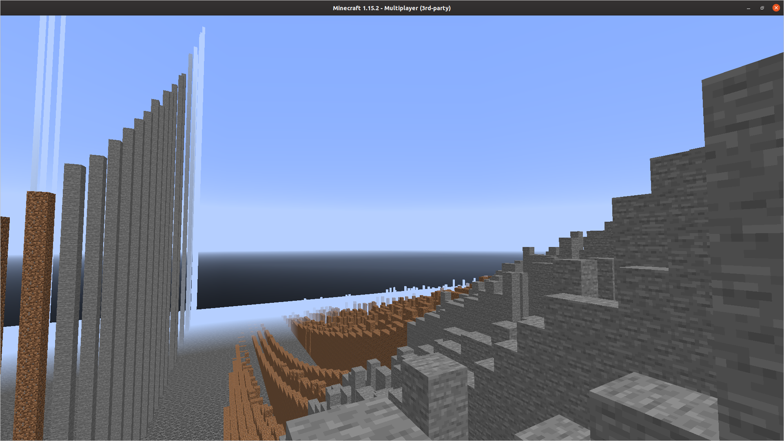

# Minegraph

See below for how to get this thing running. The python3 program graph.py takes data.json
as input and loads it into minecraft. I bundled some data for options pricing so it'll do
something interesting out of the box. 

## Example data.json
{
     "155" : {
        "275" : {
         "block" : "dirt",
         "height" : 9
        },
     }
}

I've implemented dirt, stone and bedrock.

The real magic happens in the anvil-parser and nbt lib. I just used the same 
license as them to carry it forward. You are free to do whatever with my code, so long
as you think of me wistfully and maybe even say hey. Come work with/for me at my startup.

One of the tricky minecrafty things is to figure out which region file you are adjacent 
to, not the one you're on. If you're in survival mode it helps to put a bed right next 
water. You can then place a block in the water and ride the falls down, and if you die 
you'll just spawn right next to the graph again, and this makes for easy death-warping 
out of the graph by jumping into the void or whatever.

## Versions

I made this on an ubuntu install running 19.10, no promises for other posix compatible systems...

This seems to work OK with both minecraft 14.4 and 15.2. The anvil-parser doesn't work on
anything older, and loading the region files in 13.x caused it to barf a bunch of stack
pops. Sort of a bummer since these are significantly slower than 1.11, for example.

$ java -version
openjdk version "11.0.6" 2020-01-14

## Python3 deps

pip3 install git+https://github.com/matcool/anvil-parser.git
pip3 install nbt
pip3 install frozendict

## Node

~/code/minegraph$ node -v
v10.19.0

$ ls
CBOE_SPY_Chain_Apr14_close.csv  generate.js  LICENSE   package.json
csvtomca.sh                     graph.py     merge.js

~/code/minegraph$ npm install
npm notice created a lockfile as package-lock.json. You should commit this file.
npm WARN minegraph@1.0.0 No description
npm WARN minegraph@1.0.0 No repository field.

added 5 packages from 30 contributors and audited 6 packages in 1.414s
found 0 vulnerabilities

~/code/minegraph$ ./csvtomca.sh 
Usage: ./csvtomcs.sh [FILE]
esax@routan:~/code/minegraph$ ./csvtomca.sh CBOE_SPY_Chain_Apr14_close.csv 
parsing file CBOE_SPY_Chain_Apr14_close.csv
SPY (SPDR S&P 500 ETF Trust),283.65,7.99
Apr 14 2020 @ 14:59 ET,Bid,283.65,Ask,283.66,Size,17x8,Vol,90068093
processing 5031 calls and 5031 puts...
json files generated
Generating mca file...

~/code/minegraph$ ls -lth graph.mca 
.... 4.1M Apr 15 15:28 graph.mca

cp graph.mca ~/mine-server15/world/region/r.0.0.mca

